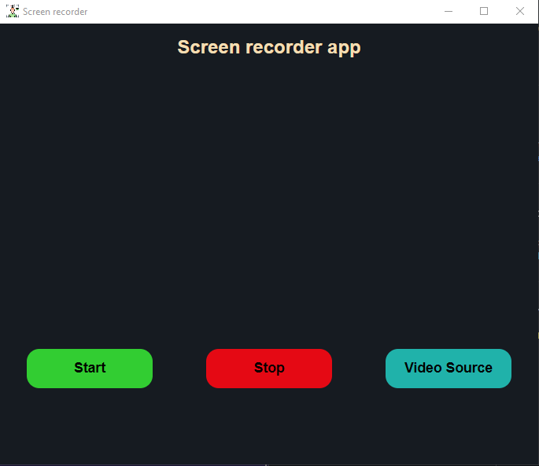

# Screen Recorder

A simple screen recorder app made with [ElectronJS](https://www.electronjs.org/).

## Electron version

The [screenRecorder folder](./screenRecorder/) contains the electron app. Assuming you have [npm](https://www.npmjs.com) installed, clone the repo, go inside the [screenRecorder folder](./screenRecorder/) and run the following code:

```
npm i && npm start
```

To build the .exe file for your own OS run the following code:

```
npm run make
```

## Examples

Electron app
<br>
<p align="center">
  
</p>
